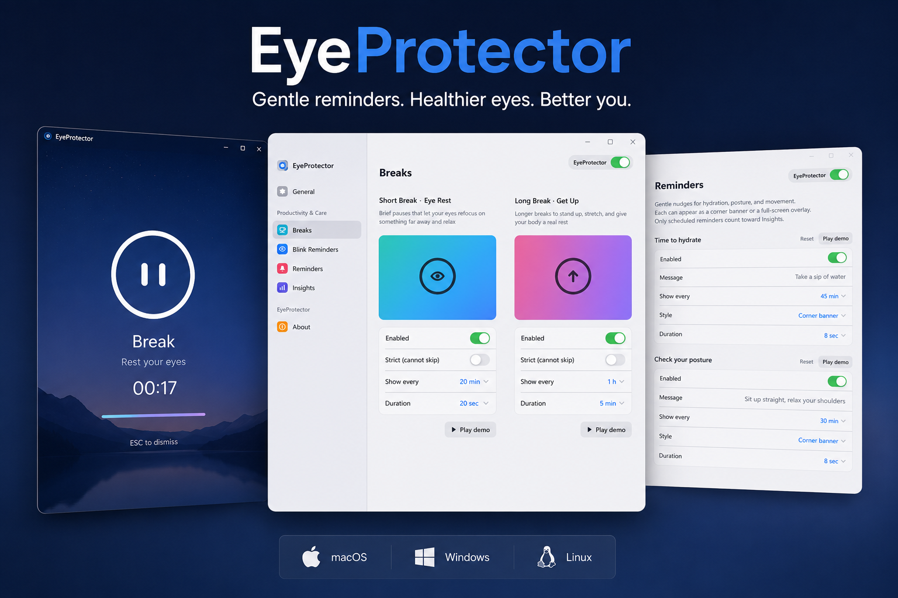
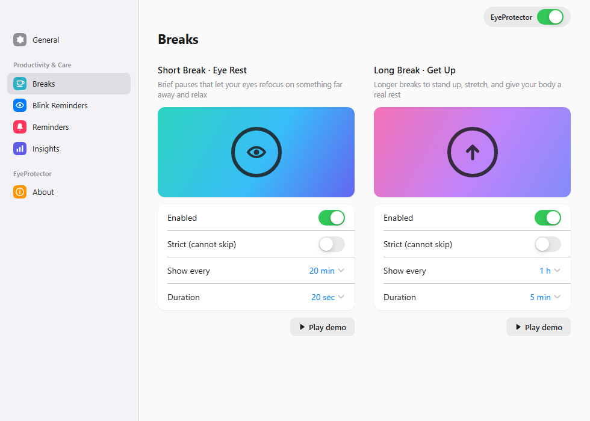
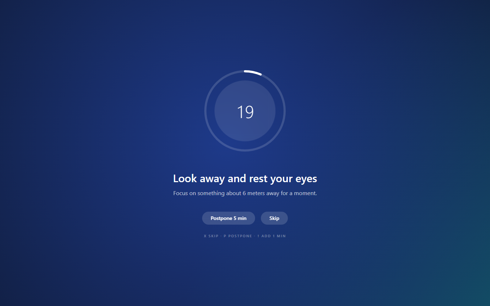
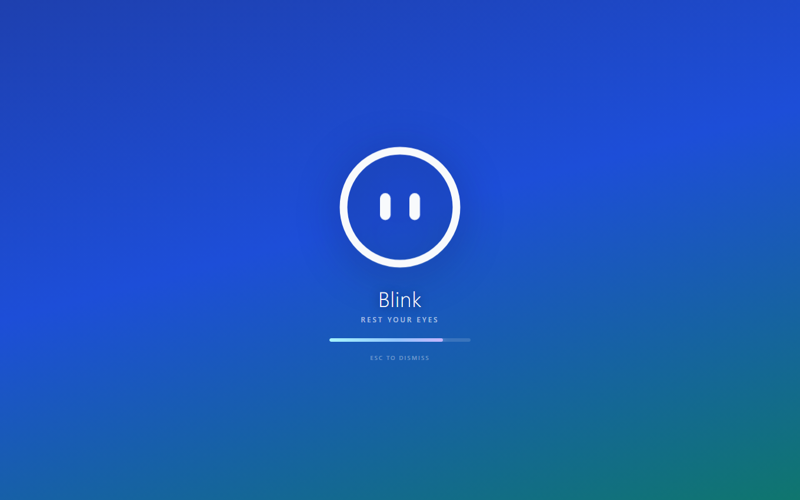
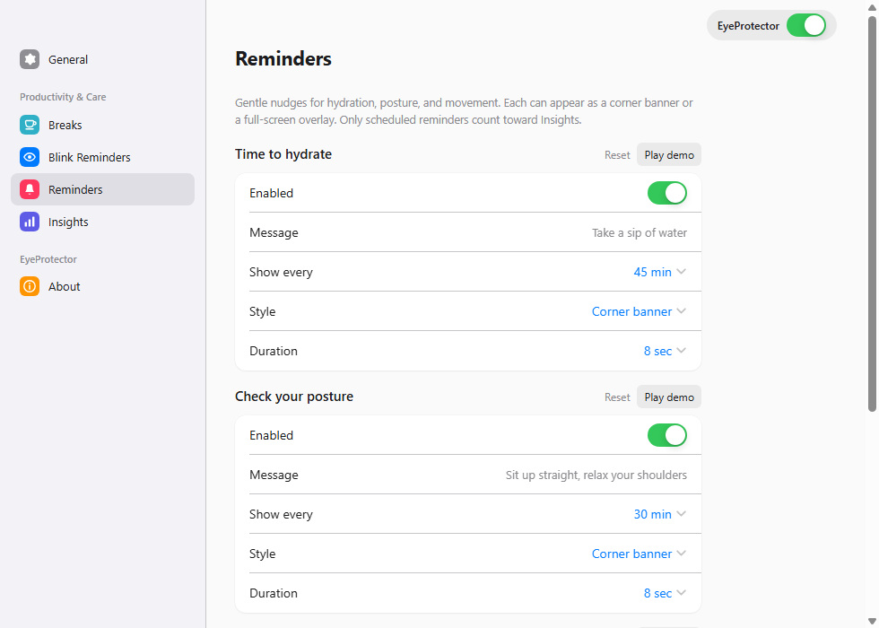
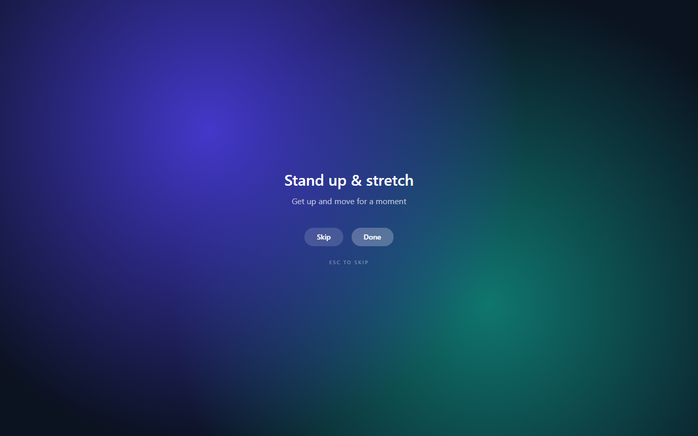
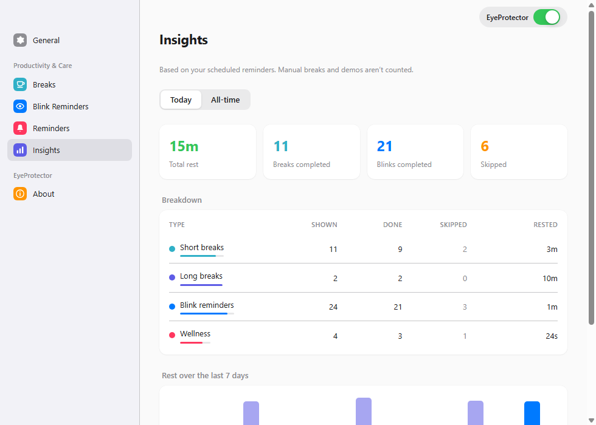

<div align="center">

# 👁️ EyeProtector

**Gentle blink reminders and screen breaks that keep your eyes healthy while you work.**

A cross-platform desktop app — **macOS · Windows · Linux** — built with Electron + React.
It lives quietly in your tray and enforces the **20-20-20 rule** with beautiful full-screen
break overlays on every monitor.



</div>

---

## ⬇️ Download

Grab the latest installer from the [**Releases**](https://github.com/Suleiman700/EyeProtector/releases) page:

| Platform | File |
|----------|------|
| macOS | `.dmg` (installer) / `.zip` |
| Windows | `EyeProtector Setup <version>.exe` |
| Linux | `.AppImage` |

> Builds are currently **unsigned**, so you'll see a one-time warning on first launch —
> on Windows click **More info → Run anyway**, on macOS **right-click → Open**. EyeProtector
> checks for new versions on launch and shows an in-app update banner when one is available.

---

## ✨ Features

- 👁️ **20-20-20 breaks** — short eye-rest and longer get-up breaks on a schedule you control
- 🖥️ **Multi-monitor overlays** — animated full-screen break screens on every display
- ✨ **Blink reminders** — gentle prompts to keep you blinking while you focus
- 🧘 **Wellness reminders** — hydration, posture, and stretch nudges as corner banners or full overlays
- 🎛️ **Master toggle & Focus** — pause everything in one click, or silence reminders for a set time
- 📊 **Insights** — track rest time, completion, and a 7-day trend
- 🪫 **Battery saver** — eases off activity automatically when on battery
- 🔕 **Smart skipping** — stays out of the way when you're idle or in a fullscreen app
- ⚙️ **Deep customization** — intervals, durations, gentle vs. strict modes, sounds, autostart

---

## 📸 Screenshots

### Breaks — the 20-20-20 core

Configure short "eye rest" and long "get up" breaks independently: interval, duration, and
whether each break is skippable or **strict** (locked until it ends).



### The break overlays

<table>
  <tr>
    <td width="50%"></td>
    <td width="50%"></td>
  </tr>
  <tr>
    <td align="center"><em>Short break — breathing ring + countdown</em></td>
    <td align="center"><em>Blink reminder — a calm nudge to blink</em></td>
  </tr>
</table>

### Wellness reminders

Preset hydration / posture / stretch nudges (and your own), each shown as a **corner banner**
or a **full-screen overlay**.

<table>
  <tr>
    <td width="52%"></td>
    <td width="48%"></td>
  </tr>
</table>

### Insights

See how much you're actually resting — rest time, breaks and blinks completed, skip counts,
and a 7-day trend.



---

## 🩺 How it works — the 20-20-20 rule

> Every **20 minutes**, look at something **20 feet** (≈6 m) away for **20 seconds**.

EyeProtector schedules those short eye-rest breaks plus longer "get up and move" breaks, and
layers on blink and wellness reminders — all fully adjustable. Breaks are skipped automatically
when you're idle or watching something fullscreen, so they never interrupt at the wrong moment.

---

## 🛠️ Development

```bash
npm install        # install dependencies
npm run dev        # run the app in dev mode (hot reload)
npm run test       # unit tests (Vitest) on the scheduler/stats logic
npm run typecheck  # TypeScript checks
npm run build      # compile main / preload / renderer to out/
```

### Build installers

```bash
npm run dist          # package installers into dist/ for the current OS
npm run dist:publish  # build + upload to a GitHub Release (needs GH_TOKEN)
```

electron-builder only builds for the OS it runs on, so produce the `.dmg` on macOS and the
`.exe` on Windows. See [`RELEASING.md`](RELEASING.md) for the full release workflow.

---

## 🧱 Tech stack

| Concern | Choice |
|---------|--------|
| Desktop shell | Electron |
| UI | React + TypeScript + Vite (`electron-vite`) |
| Styling | Tailwind CSS |
| Animation | Framer Motion |
| Config & stats | `electron-store` (typed JSON in the OS user-data dir) |
| Idle / fullscreen detection | Electron `powerMonitor` + display heuristics |
| Packaging | electron-builder → `.dmg` / `.exe` / `.AppImage` |
| Tests | Vitest |

---

## 📄 License

Released under the [MIT License](LICENSE). Copyright © iStoreJaber.